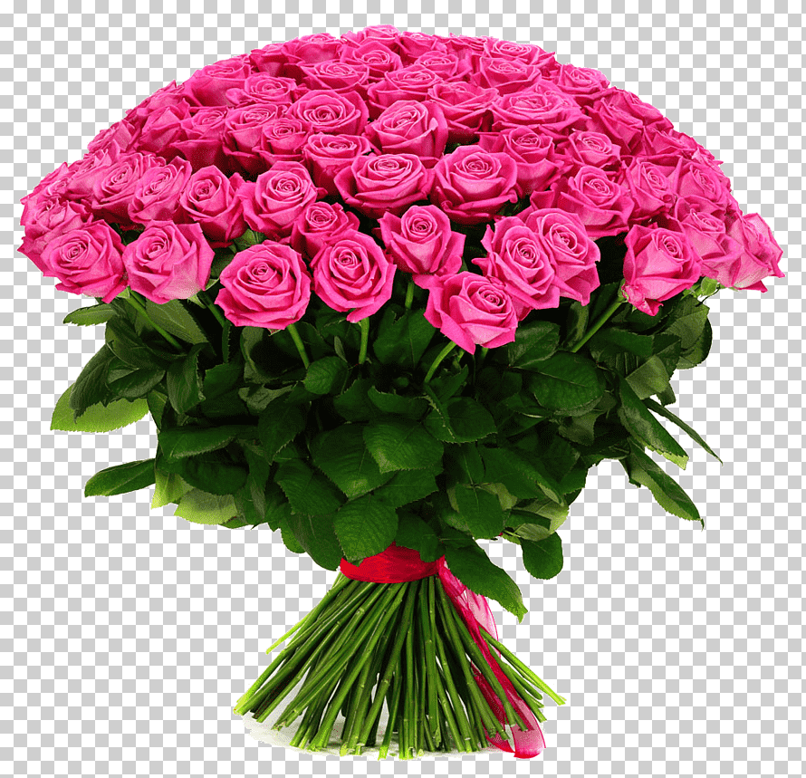
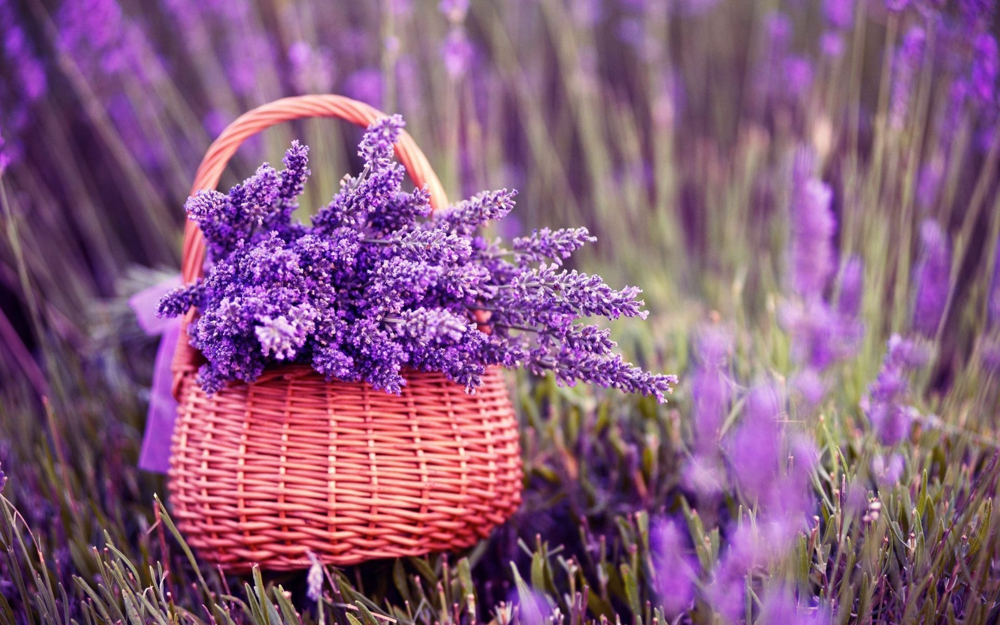
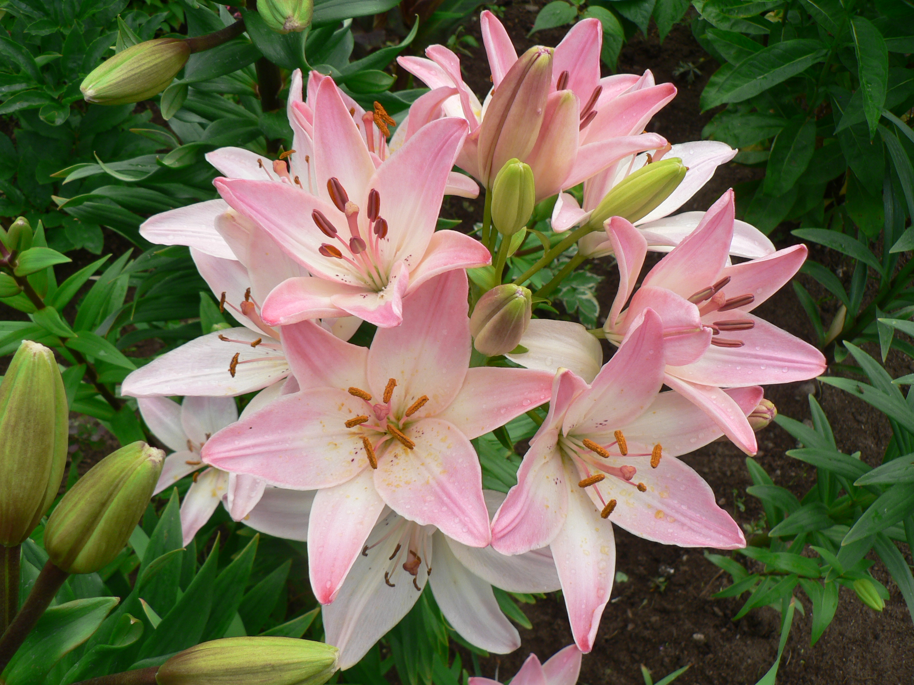

<html> 
    

    
  эти розы очень красивые и благоухают
        
        

    
    лаванду могут использовать в качестве специй
 

  

   они еще совсем маленькие и растут!
    
    

  эти розы очень красивые и благоухают

  

</html>
